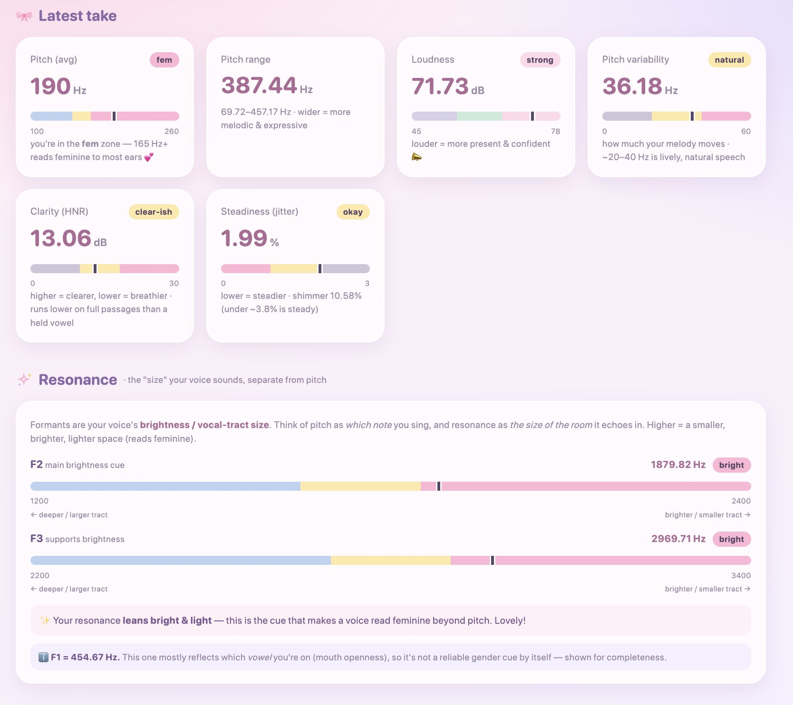

# Voice Garden

This is the only part of this repo that is primarily written by a human!! I am warning you this because I think AI disclosure is important.

This is a cozy voice feminization tool that will analyze your voice and show you metrics. I am not a professional, these metrics are my best understanding of what is useful and accurate but could be entirely wrong. Please use this as only one tool in your voice fem toolkit.

Voice Garden relies heavily on the use of Claude Code, please use Claude Code or a similar coding agent. This tool produces analysis of each voice sample using AI based on your metrics. Instead of embedding this into the UI, it is implemented using skills, so the primary way of interacting with this codebase is via a coding agent, which will run the proper skills and update the UI with the results.

For best results, I recommend that you read the same passage with a similar microphone for all of your tests, so they can be reliably compared. I personally use the Rainbow Passage.

## Usage

Open your coding agent of choice and ask it to read CLAUDE.md. It will give you a summary of how to use this application and work with you to analyze your voice.

If you don't know what a coding agent is or how to do this, DM me. I will see about packaging it for you in an easier format, but it will be less useful as I will have to remove the AI features.

## License

All code and content I wrote — `analyze.py`, the React dashboard, the Claude Code skill, and the docs — is licensed under the **MIT License** (see `LICENSE`).

Additionally, in jurisdictions where statements of this kind are legal, I dedicate my own code and content to the **public domain** — you may use it under either the MIT License or as public domain. (I offer this because many countries lack a legal framework for public-domain dedication.) This does **not** apply to the third-party assets credited below.

**Note on the analyzer's GPL dependency:** `analyze.py` uses **Praat** (via the **parselmouth** library) at runtime, both of which are **GPLv3**. The source here contains none of their code and is distributed source-only — you install parselmouth separately (via `uv`) — so this code stays MIT / public domain. **However**, if you distribute a *bundled artifact* that ships Praat/parselmouth together with this code (a compiled binary, a packaged app, a Docker image with them baked in, etc.), that combined work is covered by the **GPLv3** and must be licensed accordingly.

## Credits & third-party assets

- **Reference voices** — the preview clips in `dashboard-react/public/reference-audio/` and the measured values in `reference.json` are derived from the **VCTK Corpus** (CSTR, University of Edinburgh — Veaux, Yamagishi & MacDonald), licensed **CC BY 4.0**. The clips were trimmed and transcoded. These files remain under **CC BY 4.0**. <https://datashare.ed.ac.uk/handle/10283/3443> · <https://creativecommons.org/licenses/by/4.0/>
- **Praat** (Boersma & Weenink) and **parselmouth** (Jadoul, Thompson & de Boer), both **GPLv3**, power `analyze.py`.
- Other dependencies (React, Vite, wavesurfer.js, NumPy, …) retain their own respective licenses.
